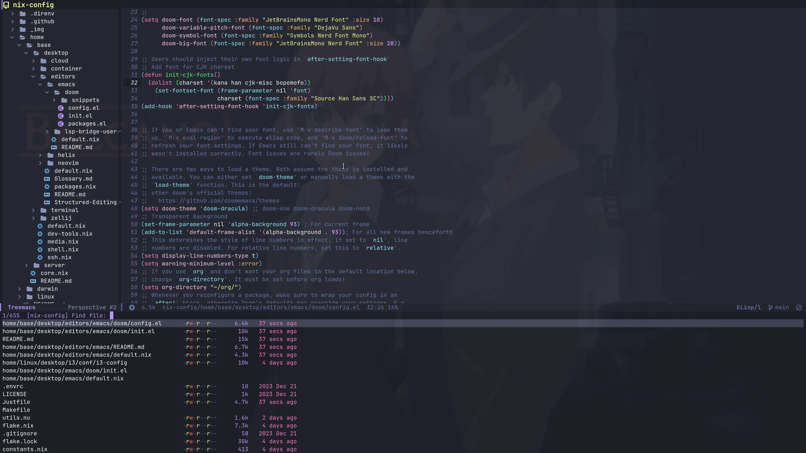

<h2 align="center">:snowflake: vitalyr's Nix Vault :snowflake:</h2>

<p align="center">
  
</p>

<p align="center">
    <a href="https://nixos.org/">
        </a>
    <a href="https://github.com/ryan4yin/nixos-and-flakes-book">
        </a>
  </a>
</p>

> This repository is tailored to my own machines and workflows. If you are new to NixOS, treat it as
> a reference and start from a smaller setup.

This repository is home to the nix code that builds my systems:

1. NixOS Desktops: NixOS with home-manager, niri, agenix, etc.
2. macOS Desktops: nix-darwin with home-manager, share the same home-manager configuration with
   NixOS Desktops.
3. NixOS Servers: virtual machines running on Proxmox/KubeVirt, with various services, such as
   kubernetes, homepage, prometheus, grafana, etc.

See [./hosts](./hosts) for details of each host.

See [./Virtual-Machine.md](./Virtual-Machine.md) for details of how to create & manage KubeVirt's
Virtual Machine from this flake.

## Why NixOS & Flakes?

Nix allows for easy-to-manage, collaborative, reproducible deployments. This means that once
something is setup and configured once, it works (almost) forever. If someone else shares their
configuration, anyone else can just use it (if you really understand what you're copying/referring
now).

As for Flakes, refer to
[Introduction to Flakes - NixOS & Nix Flakes Book](https://nixos-and-flakes.thiscute.world/nixos-with-flakes/introduction-to-flakes)

**Want to know NixOS & Flakes in detail? Looking for a beginner-friendly tutorial or best practices?
You don't have to go through the pain I've experienced again! Check out my
[NixOS & Nix Flakes Book - 🛠️ ❤️ An unofficial & opinionated :book: for beginners](https://nixos-and-flakes.thiscute.world/)!**

> If you're using macOS, see https://nixos-and-flakes.thiscute.world/ for nix-darwin notes as well.

## Components

|                                                                | NixOS(Wayland)                                                                                                      |
| -------------------------------------------------------------- | ------------------------------------------------------------------------------------------------------------------- |
| **Window Manager**                                             | [Niri][Niri]                                                                                                        |
| **Terminal Emulator**                                          | [Zellij][Zellij] + [foot][foot]/[Kitty][Kitty]/[Alacritty][Alacritty]/[Ghostty][Ghostty]                            |
| **Status Bar** / **Notifier** / **Launcher** / **lockscreens** | [noctalia-shell][noctalia-shell]                                                                                    |
| **Display Manager**                                            | [tuigreet][tuigreet]                                                                                                |
| **Color Scheme**                                               | [catppuccin-nix][catppuccin-nix]                                                                                    |
| **network management tool**                                    | [NetworkManager][NetworkManager]                                                                                    |
| **Input method framework**                                     | [Fcitx5][Fcitx5] + [rime][rime] + [小鹤音形 flypy][flypy]                                                           |
| **System resource monitor**                                    | [Btop][Btop]                                                                                                        |
| **File Manager**                                               | [Yazi][Yazi] + [thunar][thunar]                                                                                     |
| **Shell**                                                      | [Nushell][Nushell] + [Starship][Starship]                                                                           |
| **Media Player**                                               | [mpv][mpv]                                                                                                          |
| **Editors / IDE**                                              | [Helix][Helix] (primary), [Neovim][Neovim] (backup), [DoomEmacs][DoomEmacs]                                         |
| **Fonts**                                                      | [Nerd fonts][Nerd fonts]                                                                                            |
| **Image Viewer**                                               | [imv][imv]                                                                                                          |
| **Screenshot Software**                                        | Niri's builtin function                                                                                             |
| **Screen Recording**                                           | [OBS][OBS]                                                                                                          |
| **Filesystem & Encryption**                                    | tmpfs as `/`, [Btrfs][Btrfs] subvolumes on a [LUKS][LUKS] encrypted partition for persistent, unlock via passphrase |
| **Secure Boot**                                                | [lanzaboote][lanzaboote]                                                                                            |

Wallpapers: provided via the `wallpapers` flake input (see `flake.nix`).

## Wayland + AstroNvim + DoomEmacs



## Editors / IDE

- **Terminal editors:** [./home/base/core/editors/](./home/base/core/editors/) — Helix / Neovim,
  `$EDITOR`, docs.
- **VS Code (GUI, Home Manager on NixOS):**
  [./home/linux/gui/base/editors.nix](./home/linux/gui/base/editors.nix).
- **LLM coding agents:** [./agents](./agents/) — rules, installers, CLI snippets; see
  [./agents/README.md](./agents/README.md).

## Emacs

See [./home/base/tui/editors/emacs/](./home/base/tui/editors/emacs/) for details.

## Development Templates

This repository also includes standalone development templates that can be entered directly with
`nix develop`, for example:

```bash
nix develop ./templates/cpp
nix develop ./templates/bevy
nix develop ./templates/web
```

## Secrets Management

See [./secrets](./secrets) for details.

## How to Deploy this Flake?

<!-- prettier-ignore -->
> :red_circle: **IMPORTANT**: **You should NOT deploy this flake directly on your machine :exclamation:
> It will not succeed.** This flake contains my hardware configuration(such as
> [hardware-configuration.nix](hosts/idols-ai/hardware-configuration.nix),
> [Nvidia Support](hosts/idols-ai/default.nix),
> etc.) which is not suitable for your hardware, and requires my private secrets repository (via
> the `mysecrets` flake input, e.g. `vr-nix-secrets`) to deploy. You
> may use this repo as a reference to build your own configuration.

For NixOS:

> To deploy this flake from NixOS's official ISO image (purest installation method), please refer to
> [./nixos-installer/](./nixos-installer/)

```bash
# deploy one of the configuration based on the hostname
sudo nixos-rebuild switch --flake .#eva

# deploy via `just`(a command runner with similar syntax to make) & Justfile
# Deploy the nixosConfiguration matching the hostname immediately
just local

# Set it as the next boot configuration without switching immediately
just local boot

# Deploy with detailed output; use `boot debug` to combine both options
just local switch debug
# Deploy the niri nixosConfiguration by hostname match
just niri

# The niri recipe accepts the same mode and verbosity arguments
just niri boot
just niri switch debug
just niri boot debug
```

For macOS:

```bash
# If you are deploying for the first time,
# 1. install nix & homebrew manually.
# 2. prepare the deployment environment with essential packages available
nix-shell -p just nushell
# 3. comment home-manager's code in lib/macosSystem.nix to speed up the first deployment.
# 4. comment out the proxy settings in scripts/darwin_set_proxy.py if the proxy is not ready yet.

# Deploy the darwinConfiguration by hostname match
just local

# Deploy with details (macOS has no switch/boot mode argument)
just local debug
```

> [What y'all will need when Nix drives you to drink.](https://www.youtube.com/watch?v=Eni9PPPPBpg)
> (copy from hlissner's dotfiles, it really matches my feelings when I first started using NixOS...)

## Flake Outputs: Home Manager and Custom Packages

This flake exposes:

- `homeConfigurations`: standalone Home Manager configs (for non‑NixOS)
- `packages`: all custom packages under `pkgs/` (auto‑selected for the host architecture)

Common ways to use and extend them:

### Standalone Home Manager configs (`homeConfigurations`)

- List available keys:

```bash
nix eval --json --impure --expr 'builtins.attrNames (builtins.getFlake (toString ./. )).homeConfigurations' | jq -r '.[]'
```

- Build/switch (using revachol and jojo as examples):

```bash
# build
home-manager build --flake .#revachol
home-manager build --flake .#jojo

# switch
home-manager switch --flake .#revachol
```

- Where these configs are defined:
  - `outputs/x86_64-linux/src/revachol.nix`
  - `outputs/x86_64-linux/src/jojo.nix`
  - Shared Home Manager composition and helpers: `outputs/*/src/home-manager.nix`,
    `lib/homeManagerConfiguration.nix`

Note: the repo root aggregates `homeConfigurations` for all architectures, so you can reference them
directly as `.#<name>` (e.g., `.#revachol`).

### Custom packages (`pkgs/`)

Everything under `pkgs/` appears under the flake's `packages` output. You can build, spawn a shell,
or install directly.

- Example (`emacs-master-pgtk-with-igc`):

```bash
# build
nix build .#emacs-master-pgtk-with-igc

# temporary shell
nix shell .#emacs-master-pgtk-with-igc

# install to profile (optional)
nix profile install .#emacs-master-pgtk-with-igc
```

- Discover available packages:

```bash
# broad view (lots of entries)
nix flake show | less

# filter by name
nix flake show | rg -i emacs
```

#### Add a new package

`outputs/default.nix` collects packages under `../pkgs`:

- If a directory contains `package.nix`, the directory name becomes the package name.
- If there's a single `xxx.nix` file, the package name is `xxx`.
- `sources` from `pkgs/_sources/generated.nix` (generated by nvfetcher) and `genSpecialArgs system`
  (e.g., `pkgs-unstable`, `pkgs-stable`, `pkgs-patched`) are injected automatically.

Minimal example (`pkgs/hello/package.nix`):

```nix
{ pkgs, lib, ... }:
pkgs.stdenv.mkDerivation {
  pname = "hello";
  version = "1.0";
  src = ./.; # example only
  installPhase = ''
    mkdir -p $out/bin
    echo '#!/usr/bin/env bash' > $out/bin/hello
    echo 'echo hello' >> $out/bin/hello
    chmod +x $out/bin/hello
  '';
}
```

After adding it:

```bash
nix build .#hello
```

#### Use custom packages in modules

Home Manager and NixOS modules get `pkgs` with the overlay that includes everything under `pkgs/`
(see `lib/homeManagerConfiguration.nix` → `customOverlay`). You can reference packages directly:

```nix
home.packages = [ pkgs.emacs-master-pgtk-with-igc ];
```

### FAQ

- `home-manager build --flake .#<name>` can't find the config:
  - List `homeConfigurations` keys with the command above and confirm it exists.
  - Make sure your checkout is up to date and `nix flake show` lists `homeConfigurations`.
- Custom package complains about a missing source:
  - Check that `pkgs/_sources/generated.nix` and `generated.json` exist and look valid.
  - If sources need updating, run nvfetcher as you prefer (this repo doesn't enforce a workflow).

## References

Other dotfiles that inspired me:

- Nix Flakes
  - [NixOS-CN/NixOS-CN-telegram](https://github.com/NixOS-CN/NixOS-CN-telegram)
  - [notusknot/dotfiles-nix](https://github.com/notusknot/dotfiles-nix)
  - [xddxdd/nixos-config](https://github.com/xddxdd/nixos-config)
  - [bobbbay/dotfiles](https://github.com/bobbbay/dotfiles)
  - [gytis-ivaskevicius/nixfiles](https://github.com/gytis-ivaskevicius/nixfiles)
  - [davidtwco/veritas](https://github.com/davidtwco/veritas)
  - [gvolpe/nix-config](https://github.com/gvolpe/nix-config)
  - [Ruixi-rebirth/flakes](https://github.com/Ruixi-rebirth/flakes)
  - [fufexan/dotfiles](https://github.com/fufexan/dotfiles): gtk theme, xdg, git, media, anyrun,
    etc.
  - [nix-community/srvos](https://github.com/nix-community/srvos): a collection of opinionated and
    sharable NixOS configurations for servers
- Modularized NixOS Configuration
  - [hlissner/dotfiles](https://github.com/hlissner/dotfiles)
  - [viperML/dotfiles](https://github.com/viperML/dotfiles)
- Neovim/AstroNvim
  - [maxbrunet/dotfiles](https://github.com/maxbrunet/dotfiles): astronvim with nix flakes.
- Misc
  - [1amSimp1e/dots](https://github.com/1amSimp1e/dots)

[Niri]: https://github.com/YaLTeR/niri
[Kitty]: https://github.com/kovidgoyal/kitty
[foot]: https://codeberg.org/dnkl/foot
[Alacritty]: https://github.com/alacritty/alacritty
[Ghostty]: https://github.com/ghostty-org/ghostty
[Nushell]: https://github.com/nushell/nushell
[Starship]: https://github.com/starship/starship
[Waybar]: https://github.com/Alexays/Waybar
[polybar]: https://github.com/polybar/polybar
[rofi]: https://github.com/davatorium/rofi
[anyrun]: https://github.com/Kirottu/anyrun
[Dunst]: https://github.com/dunst-project/dunst
[Fcitx5]: https://github.com/fcitx/fcitx5
[rime]: https://wiki.archlinux.org/title/Rime
[flypy]: https://flypy.cc/
[Btop]: https://github.com/aristocratos/btop
[mpv]: https://github.com/mpv-player/mpv
[Zellij]: https://github.com/zellij-org/zellij
[Helix]: https://github.com/helix-editor/helix
[Neovim]: https://github.com/neovim/neovim
[AstroNvim]: https://github.com/AstroNvim/AstroNvim
[DoomEmacs]: https://github.com/doomemacs/doomemacs
[flameshot]: https://github.com/flameshot-org/flameshot
[grim]: https://github.com/emersion/grim
[flameshot]: https://github.com/flameshot-org/flameshot
[imv]: https://sr.ht/~exec64/imv/
[OBS]: https://obsproject.com
[Mako]: https://github.com/emersion/mako
[Nerd fonts]: https://github.com/ryanoasis/nerd-fonts
[catppuccin-nix]: https://github.com/catppuccin/nix
[NetworkManager]: https://wiki.gnome.org/Projects/NetworkManager
[wl-clipboard]: https://github.com/bugaevc/wl-clipboard
[tuigreet]: https://github.com/apognu/tuigreet
[thunar]: https://gitlab.xfce.org/xfce/thunar
[Yazi]: https://github.com/sxyazi/yazi
[Catppuccin]: https://github.com/catppuccin/catppuccin
[Btrfs]: https://btrfs.readthedocs.io
[LUKS]: https://wiki.archlinux.org/title/Dm-crypt/Encrypting_an_entire_system
[lanzaboote]: https://github.com/nix-community/lanzaboote
